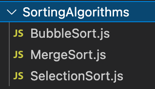
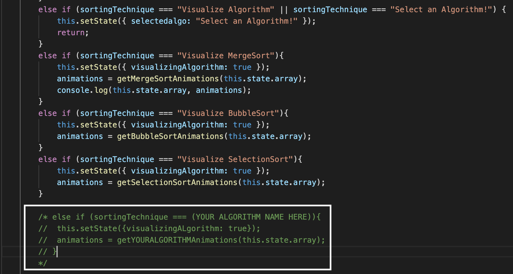
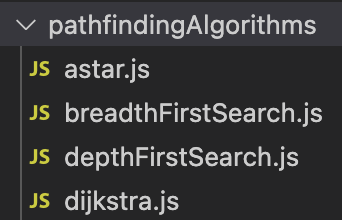
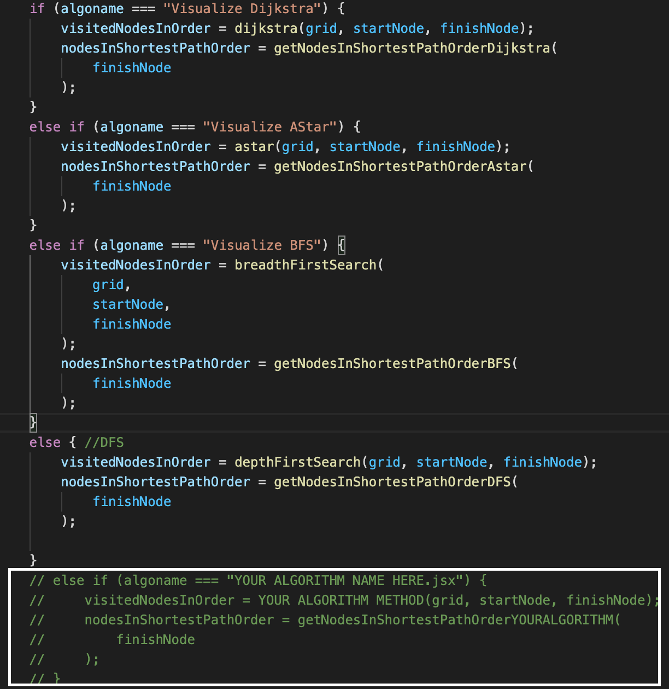

# Project Deployed on Heroku
The Live demo of the project can be viewed at: https://algoviz1.herokuapp.com/

# Run this app in your system

This project was bootstrapped with [Create React App](https://github.com/facebook/create-react-app).

In the project directory, you can run:

### `npm start`

Runs the app in the development mode.\
Open [http://localhost:3000](http://localhost:3000) to view it in the browser.

# Contribute more algorithms into this project

This is an open-source project. We welcome anyone to contribute their own algorithms into the visualizer. Integrating process has been made very generalized in order to reduce the hassle as much as possible.

## Contributing Sorting algorithms:

This project currently consists of the following sorting algorithms:
* Merge sort
* Bubble sort
* Selection sort

In order to contribute a new sorting algorithm, you have to ensure the following steps:

### 1) Add your code into a new Javascript file to the folder `src/SortingAlgorithms`

Algorithm has to be implemented in the form of a Javascript function, with the array as it's parameter. It must return, to it's parent component, a visualization array with the elements in the following form.

### 2) Add the calling function

Inside the <a href="https://github.com/panshulbh16/algoviz/blob/master/src/SortingVisualizer/SortingVisualizer.jsx">SortingVisualizer.jsx</a> file, you must add a calling function under of the <i>sort</i> method. This calling function takes the following form:

`else if (sortingTechnique === (YOUR ALGORITHM NAME HERE)){
    this.setState({visualizingALgorithm: true});
    animations = getYOURALGORITHMAnimations(this.state.array);
}`

You can understand more about this step <a href="https://github.com/panshulbh16/algoviz/blob/master/docs/images/Sorting_viz_fns_open_source.png">here</a>.

### 3) Add basic information such as complexities, and you're ready to go!

Finally, basic information of your algorithm such as it's name, it's function calling name and a basic write-up (with the complexities) must be added to the <a href="">allAlgorithms_sorting.js</a> javascript object which will automatically add your information to the dropdown menus.

## Contributing Pathfinding Algorithms:

This project currently consists of the following sorting algorithms:
* A-star
* Dijkstra's
* Breadth First Search
* Depth First Search

In order to contribute a new Pathfinding Algorithm, you have to ensure the following steps:

### 1) Add your code into a new Javascript file to the folder `src/pathfindingAlgorithms`

Algorithm has to be implemented in the form of a Javascript function, with the <i>grid, starting node and goal node</i> as it's parameter. It must return, to it's parent component, an array comprising of all of the visited nodes and an array comprising of nodes in the shortest path in order.

### 2) Add the calling function

Finally, inside the <a href="https://github.com/panshulbh16/algoviz/blob/master/src/SortingVisualizer/pathfindingVisualizer.jsx">PathfindingVisualizer.jsx</a> file, you must add a calling function inside of the <i>visualizeAlgo</i> method. This calling function takes the following form:

`else if (algoname === "YOUR ALGORITHM NAME HERE.jsx") {
                visitedNodesInOrder = YOUR ALGORITHM METHOD(grid, startNode, finishNode);
                nodesInShortestPathOrder = getNodesInShortestPathOrderYOURALGORITHM(
                    finishNode
                );
            }`

You can understand more about this step <a href="https://github.com/panshulbh16/algoviz/blob/master/docs/images/Pathfinding_viz_fns_open_source.png">here</a>.

### 3) Add basic information such as complexities, and you're ready to go!

Finally, basic information of your algorithm such as it's name, it's function calling name and a basic write-up (with the complexities) must be added to the <a href="">https://github.com/panshulbh16/algoviz/blob/master/src/PathFindingVisualizer/allAlgorithms_pathfinding.js</a> javascript object which will add your information to the dropdown menus.

Further thorough explanations have been provided in the code as comments and will guide you to have your algorithm set up and ready to be visualized!
